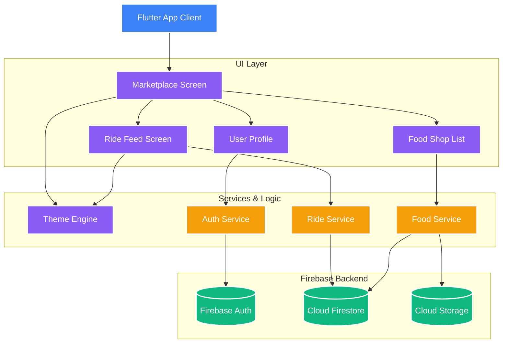

# Marketplace App

A modern, full-stack Flutter application combining Ride Sharing and Food Delivery into a single, seamless platform. Built with Firebase as the backend and featuring a stunning UI with full Dark/Light theme support.

## 🚀 Features

- **Ride Sharing**: Offer or find rides with advanced filtering (by gender, location, active/past).
- **Food Delivery**: Browse restaurants, filter by cuisine (Biriyani, Rice, Roti, Noodles), and view shop menus.
- **Dynamic Theming**: Full support for system and user-toggled dark and light modes, built with a premium aesthetic design system.
- **Image Caching**: Optimized network image caching (`cached_network_image`) for smooth, jitter-free scrolling.
- **Real-time Backend**: Integrated with Firebase for authentication, firestore data, and scalable infrastructure.

---

## 🏗 Architecture Diagram



---

## 💻 Tech Stack

- **Framework**: Flutter (Dart)
- **Backend**: Firebase (Auth, Firestore, Storage)
- **UI & Styling**: Custom internal `AppTheme` engine with Google Fonts
- **State Management / Async**: Streams & StreamBuilders
- **Caching**: `cached_network_image`

---

## ⚙️ Setup & Installation

1. Clone the repository:
   ```bash
   git clone https://github.com/priyankarpadhy-eng/marketplace_app.git
   ```
2. Fetch dependencies:
   ```bash
   flutter pub get
   ```
3. Setup Environment Variables:
   - Create a `.env` file in the root directory.
   - Add your Firebase API keys and environment secrets.
   *(Note: The `.env` file is git-ignored to prevent leaking credentials.)*

4. Run the app:
   ```bash
   flutter run
   ```

---

## 🎨 Design Philosophy

Every interface is built with premium Webflow/Framer-style aesthetics:
- **Typography**: Paired fonts for heading and body with tailored line-heights.
- **Spacing**: Strict adherence to an 8px base unit grid.
- **Colors**: Deliberate semantic color usage with tinted neutral backgrounds.
- **Motion**: Subtle micro-interactions, avoiding heavy, janky animations.
